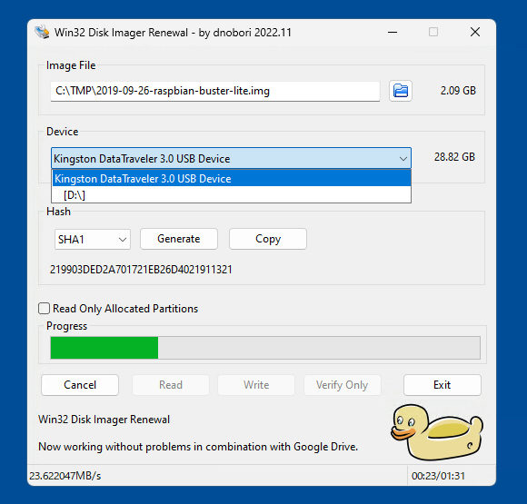
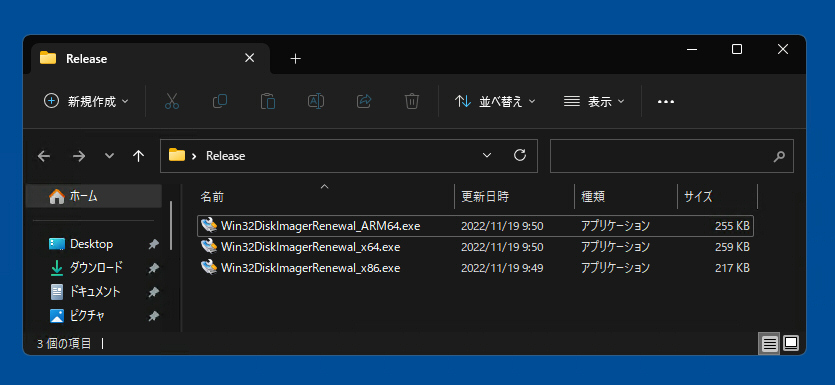
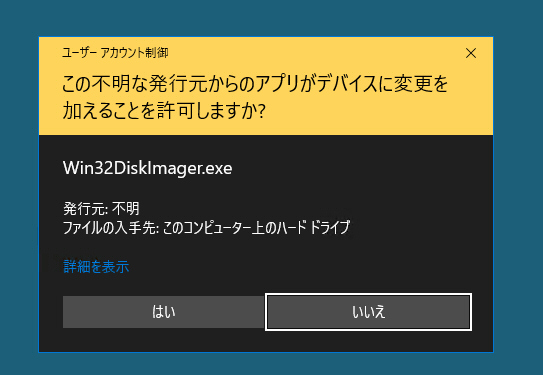
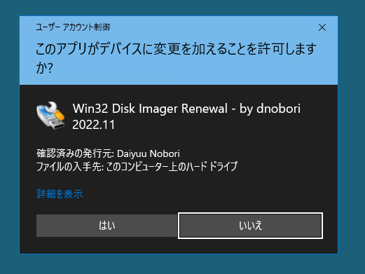

# Win32 Disk Imager Renewal - by dnobori 2022.11

このリポジトリは、Windows 上での USB メモリ / SD カードイメージ書き込みツールのデファクト・スタンダードとなっている Win32 Disk Imager について、以下の点を改良した **「Win32 Disk Imager Renewal」** の [**デジタル署名済みの EXE 単体で動作する Win32 / x64 / ARM64 版バイナリ**](https://github.com/dnobori/DN-Win32DiskImagerRenewal/releases/) とソースコードを配布するためのものである。  


[**👉 Win32 / x64 / ARM64 版バイナリ (署名済み、インストーラ不要) のダウンロード**](https://github.com/dnobori/DN-Win32DiskImagerRenewal/releases/)

### 改良点

- (1) PC 上で Google Drive が起動していても、Win32 Disk Imager が起動できるようにした。原版では、相性問題で、エラーが発生していた。  
- (2) 原版は 10Mbytes 程度のサイズがあり、1 つの EXE と 18 個の DLL が必要であったが、このバイナリは、200Kbytes 程度の 1 つの EXE にまとまっている。Win32 Disk Imager を使用したことがない人に EXE を配布する際の作業が、極めて簡単になった。  
- (3) 登の責任でデジタル署名を行ない、Windows UAC の黄色い警告画面が表示されないようにして、企業環境でも利用しやすいようにした。  
- (4) 原版は x86 (32bit) 版のみであったが、x64 (64bit) および ARM64 (64bit) 版もビルドした。最新の Windows 11 ARM64 版でも、ネイティブで動作する。  

[Win32 Disk Imager](https://sourceforge.net/projects/win32diskimager/) は、ディスクイメージファイルを USB メモリや SD カードに書き込む際に利用できる、優れた Windows 用ツールである。Win32 Disk Imager は、Tobin Davis 氏によって 2009 年に開発された。

Win32 Disk Imager は、システム管理者や Raspberry Pi 等を活用する組み込み技術者おなどの、コンピュータに詳しい知識を有するユーザーの間で、Windows 上のイメージ書き込みアプリケーションとして、デファクト・スタンダード的なツールとなっている。


 


 


## 2. 原版の Win32 Disk Imager の問題点
原版の Win32 Disk Imager には、以下の問題点があった。

1. **Google Drive との相性問題。**  
    - Google Drive クライアントアプリケーションを稼働させている Windows 環境では、Win32 Disk Imager の起動時に、エラーが発生し、正常に利用できない。
    - この問題は、Google Drive の仮想ドライブ機能 (`G:\` 等) が有効になっている場合に発生する。
    - Google 社は、[Dokan (Windows 用 FUSE ドライバ)](https://github.com/dokan-dev/dokany) を改造したデバイスドライバを用いて仮想ドライブを実装している。しかし、この仮想デバイスドライバと Win32 Disk Imager とは相性が悪く、Win32 Disk Imager の起動時のデバイス列挙時にエラーが発生しているようである。
    - そこで、Google Drive と Win32 Disk Imager の両方を利用するユーザーは、Win32 Disk Imager を起動する都度、Google Drive を一時的に終了しているのである。しかし、これはユーザーにストレスが生じる。
    - そのため、Google Drive が起動している時に Win32 Disk Imager を起動しても、エラーが無視される仕組みが必要である。

2. **EXE ファイル単体で動作せず、ZIP 展開またはインストールが必須である。**
    - Win32 Disk Imager は単一の EXE ファイルで構成されず、18 個もの追加 DLL ファイルを必要とする。したがって、Win32 Disk Imager を使用する場合は、インストーラによるインストールか、ZIP ファイルでまとめたファイルの展開を必要とする。
    - たとえば、Raspberry Pi の大量デプロイ時においては、システム管理者が、他のシステム管理者 (素人等) に依頼して、複数人で手分けし、あるイメージファイルを大量の SD カードに書き込む作業が、しばしば発生する。
    - この際に、素人システム管理者はこれまで Win32 Disk Imager を利用したことなどないのであるから、玄人システム管理者は、素人システム管理者に対して、URL を Slack 等で提示し、そこからダウンロードしてインストールするよう指示する必要がある。この際に、大きなファイルのダウンロードやインストールまたは ZIP の展開といった追加作業が必要になってしまう。
    - そこで、Win32 Disk Imager を単一の EXE ファイル (その EXE ファイルのみをダウンロードして実行すれば直ちに起動することができ、実行において追加の DLL ファイルが一切必要のないもの) で動作することを可能にするポータブル EXE ファイルが、是非とも必要である。

3. **オリジナル配布元の EXE は、デジタル署名されておらず、起動時に Windows UAC の黄色いいやな警告画面が表示される。**
    - Win32 Disk Imager は幅広く利用されているにもかかわらず、その EXE ファイルはデジタル署名されていない。そして、Win32 Disk Imager は、実行時にシステム権限への昇格が必要であるが、デジタル署名されていないので、実行時に Windows UAC (User Account Control) の黄色い警告画面が表示される。
 
    - そのため、2 のように、玄人システム管理者が素人システム管理者に対して Win32 Disk Imager の実行を指示すると、Windows UAC の黄色い警告画面が素人システム管理者の Windows デスクトップに表示されることになり、素人システム管理者は、ろうばいすることになる。
        - なぜならば、昨今の素人システム管理者は、買ってきた保証付きの製品を使用することだけで満足している状況であり、自らのリスクでオープンソースソフトウェアをダウンロードして業務に利用したり、必要に応じて自らソースコードを改造してコンパイルし、管理ツールを作成したりするというような、システム管理者にとって当然必要な作業を、生まれてから一度も行なったことがないというような状況にある場合もあるためである。誠に残念なことに、最近の企業におけるシステム管理者たちにおいては、このように、圧倒的に必要な経験知識が不足しているのである。
        - すなわち、彼らは管理対象のシステム群の表面的利用方法 (ユーザーとほとんど同一の視点における利用方法) のみを一応習得しているに過ぎず、対象システムがどのように動いているのか、対象システムにおいて不具合が発生した場合に自力でこれらの問題を解決するためにはどのような手法が存在するか、というような、凡そシステム管理者として必須の能力を、全く有していないのである。これでは、システム管理者は表面的な作業をのぞき、本質的なシステム管理を行なうことが全く不可能である。彼らは、システムの中身について必要な知識経験を習得することもできない。
        - 最近の企業におけるサイバーセキュリティ問題の多発の原因は、上記のとおり、企業のシステム管理者が、様々な試行錯誤を行なうことをせず、または組織的にそのようなことが禁止され、よって自らの判断を信頼することができない程度に、システム管理業務に必要な専門知識が欠けた状態が、10 年間程度、誤って維持されてしまったことに起因するのである。そして、先輩玄人システム管理者たちは、10 年以上前にそういった知識を身に付けているから、何ら不自由はない。しかし、後輩の玄人システム管理者たちにその秘技を伝授するためには、企業内において、物理的なサーバーやワークステーション、ネットワーク機器、ディスク等を用いて試行錯誤を行なう仕事の場が必要となる。ところが、最近の企業内においては、外注主義や、過度・無意味・または長期的にみると逆にトータルコストが上がってしまうようなクラウド移行などが、一時的に誤って蔓延している状態となっている。このことが、企業のシステム管理部門において最低限必要な IT スキルの維持が困難となった直接的原因である。
        - ところが、各企業においては、最近 10 年間程度は、一応は、協力会社にシステム管理業務の外注を行なうことにより、システム管理に必須の IT スキルの継続・維持をしばらく行なわない状態でも企業の継続をかろうじて維持できてきた。
        - この外注主義は、本来自社においてシステム管理に必須の IT スキルを有する人材の育成をする投資 (その支出は一時的なものであり、これにより、長期的な利益が得られるので、これは、コストではなく、まさに投資である) を節約することができるが、同時に、
          - (1) 外注費用を、外部会社に継続的に支払う必要が生じる。これはまさしく掛け捨て型のコストである。なぜならば、それによって外注先における技術力という資産は蓄積されるが、発注者には蓄積されないためである。
          - (2) 外注することにより、外注した専門的事柄については自ら勉強・人材育成する必要がなくなるので (これが外注の短期的メリットである)、しばらくすると自社人材のシステム管理に必要な能力が低下する。よって、ますます外注に依存することとなる。もちろん、将来のいずれかの時点では、この悪循環を断ち切る必要があるのである。しかし、健全な状態に戻るためにかかるコストは、経年ごとにどんどんと増大する。ついには、いざ、悪循環を断ち切り健全化を行なう必要が迫ったときには、すでに、健全化が著しく困難または不可能な状態に陥っていることになる。
          - (3) 外注先が実作業を行ない、発注元は外注先に対して各種の業務依頼を行なうことになる。発注元の自社としては、業務依頼は文書 (メール、パワーポイント、Teams 等) で行なうことになる。そこで、システム技術の本質があまり分かっていないのに、文書やコミュニケーション能力、調整能力といった面の能力が高い者が、自社のシステム管理担当 (実質的には、外注業者との調整担当) として割り当てられる。これにより、「システム管理部門」=「調整部門」であるという誤った性質の認識が、組織内に固定的に付着してしまうことになる。本来、企業のシステム管理部門というのは、工夫を凝らして問題を解決したり、対象技術の内奥をできる限り理解していって、これまで未解決であった問題を解決し、これまで実現することができなかった高度な業務や、快適なユーザーコンピューティング環境を実現・開拓するための、楽しい職場であったはずである。そのような本来あるべきシステム管理部門においては、高い能力を有する IT 人材 (まさに現在の日本が人材不足により困っているデジタル人材) たちが、原則として、互いに独立して自由な思考を行ない、各自自分の判断を信頼し、企業の対象システム管理や改良を手を動かして日々行なっていくことができる。この本来手法を用いれば、企業として必要なシステム改良を、短時間で、的確に行なうことができ、問題が生じても解決が容易である。そして、これらのシステム管理業務は、コンピュータが好きな人材にとっては、大変楽しいものである。そこで、より若い潜在的入社希望者人材 (学生など) の間に、その組織のシステム管理部門は楽しいらしいと言う、良い評判が、自然に広まることになる。すると、大学時代にコンピュータや通信、サイバーセキュリティ等に関する高度で複雑で本質的な知識を、大学内と、大学外での様々な活動によって身に付けた、価値の高い人材が、どんどんと企業に入社してくるようになるのである。このような好循環により、企業は、高いレベルを有するデジタル人材を多数獲得することができるのである。そのような人材の活躍の場は、もちろん、システム管理部門に限られない。システム管理部門は、そのような人材にとって、企業への玄関に過ぎない。彼らは、システム管理に於いて、様々な経験を積み、その過程で、使用しているシステムソフトウェアやアプリケーションに関して、単なる挙動だけでなく、その内側にある動作原理、そのシステムを作った元の開発者たちの設計思想に触れることになる。そして、その自社内で利用しているソフトウェアと他の関連システムや、インターネットや、クラウド等の、無限の広がりを有するデジタル・コンポーネントとの相互連携を日々自然に考えることになる。彼らは、企業の管理職から一々命じられなくても、楽しいことであるから、そのような一歩進んだ探求的行為を、企業のリソースを活用して、毎日のように行なうのである。彼らは、いわば企業そのものを実験場として、新しいシステム上の工夫を凝らした試みを推進するのである。そのうちに、システム間相互連携や、新しいアプリケーションの開発等を行なう際、単に表面的なスクリプト言語や Web 言語のみでは、実現したいことが実現できないことに気付くのである。そうして、これまでシステム管理者として必要であった表面的プログラミング・スキルを超えて、システムソフトウェアに関するプログラミング能力を身に付け始めることになる。そして、既存のソフトウェアでは実現できないような、高度な、又は高速な、或はスケーラビリティのある、若しくは既存の障壁を上手く乗り越えるような、新しいソフトウェアを書き始めるのである。このように、組織内に試行錯誤が好きな人材がおり、当初は既存のシステムを使用していたものの、それに満足できずに、新たなシステムを作り始めるという行動パターンが、まさに現代のデジタル社会を作り上げたことは、歴史が証明している。1969 年の「UNIX および C 言語」の発明 (AT&T 社の社員たち)、1982 年の「ルータ」の発明 (スタンフォード大学の職員たち、後の Cisco 社)、1990 年の「Web ブラウザ / HTTP」の発明 (CERN = 欧州原子核研究機構の職員)、1992 年の「Java」の発明 (Sun Microsystems 社で家電ファームウェアを作ろうとしていた社員)、2006 年の「Amazon AWS (当時の EC2)」の発明 (2000 年に Amazon 社内の書籍販売 Web システム用の大量の Sun サーバーと Cisco ルータを、安価な大量の Linux に置き換えるために社員が作った社内向けシステムが起源である) 等、無数の例が存在する。このように、組織においては、高度なデジタル人材は、まずシステム管理行為への熱中から生じるのである。最初は自社のシステム上の問題を解決するために小さなコードの改良を行なおうとするが、それが一度上手く行くと、大変な喜びを感じるので、次に、自然に、それを汎用的に利用できるシステムコードに変形し、一般化することになる。その成果が洗練されていけば、これは、世界中に受け入れられ、率先して利用されるようになる。わかりやすい例として、先に述べたような、UNIX、C 言語、Cisco ルータ、Web ブラウザ、Java、Amazon AWS 等の世界的な IT 技術が、ついには自企業内から登場するのである。そして、このような一連の行為を、企業が推奨または少なくとも黙認することは、当該企業の将来価値は、大きく高まる。数々のデジタル製品が生まれる。その企業は、自らを中心として、それらを世界中に普及させることにより、大きな利益を得ることができる。前記の例は極端に大きな価値が生じた例であるが、このような規模に至らなくとも、より小規模な成果であっても、企業に対しては極めて大きな利益をもたらす。そして、そのような利益の大きさは、システム管理行為を外注によって一見実現したかのように見せかけるという短絡的な解決策によって一時的に節約できる、社内における内製的システム管理にかかるわずかな人件費を、大きく上回るものである。そもそも、企業の存在の条件は、このような技術的革新を日々行なうことにある。企業継続のためには、日々わずかな技術的進歩でもよいので、他社とは異なることをしなければならない。技術的革新の発生の可能性だけが、資本主義制度や、これに基づく企業の存在を、より根源的には、人間そのもの存在を、さらには、知性の存在を、正当化するのである。  
          ところが、企業が自社のシステム管理を安易に外注する外注主義は、上記のような自社から生じる素晴らしい価値の可能性を、直ちに喪失させることになる。「あの会社のシステム管理部門は、名ばかりの外注文書屋の集まりである」という評判が学生に伝わり、価値の高い人材は集まらない。そういった人材は、そのような企業ではなく、いわゆる GAFA やスタートアップ企業へ行ってしまうのである。これは、誠にもったいないことである。日本の強みは、長年かけて継続的に形成してきた、企業の有する規模・リソース・設備・人材・組織体制・営業能力・実顧客という、他の国よりも優れた国内資産である。この日本固有の「日本企業」という国内資産の価値と能力は、「ベンチャー・キャピタル」等の海外で盛んな投資の仕組みに匹敵するか、それを大きく凌駕する。この国内資産を最大限に有効活用して、若手人材が試行錯誤を行ない、日々の技術的革新を行なえば、その成果は、このような資産がないところで一から起業された海外のスタートアップ事業体が、海外の短絡的金銭利益重視型のベンチャー・キャピタルによって投資を受けた場合と比較して、より大規模に、より長期間に、また現有設備、人材、組織、営業能力、実顧客ネットワークを活かして、数々の価値の高いデジタル技術・デジタル製品を作ることができるのである。そのためには、国内資産の価値と能力は、正しく活用されなければならない。しかし、それを活用する主体である日本企業が、最も技術革新が生じやすいコンピュータシステム管理という領域において、外注主義等により、そのイノベーション行為を推進するどころか、誤って阻害してしまっているのである。これにより、日本企業からは能力の高いデジタル人材が生じず、よって、米国に匹敵するようなコンピュータ・プラットフォーム事業やインターネット事業がなかなか生じないという、大きな逸失利益が生じているのである。
        - というような、大変に大きな代償を支払わなければならない。しかし、これは、外注先が一定のシステム管理専門能力を有しており、(1) の外注費用の支払いに応じて、適切なサービスを提供してくれる間は、表面上は、問題にならない。
        - ところが、2020 年頃になって、新たに、
          - (4) ついに、日本企業が頼っていたシステム管理の外注先の会社においても、同様な安楽な思想により、社員の人材育成がなされず、したがって、「外注先業者」の社員の能力が、健全なシステム管理業務に必要な最低水準を下回る現象が発生し始めた。
        - という現象がしばしば見られるようになった。すなわち、ついに、業界全体の流れとして、技術力不足のショートが発生してしまっているのである。
    - さて、本題に戻ると、日本企業やシステム管理外注先企業においては、今や、このような一連の経緯により、2 のように、玄人システム管理者が素人システム管理者に対して Win32 Disk Imager の実行を指示すると、Windows UAC の黄色い警告画面が素人システム管理者の Windows デスクトップに表示されることになり、素人システム管理者は、ろうばいすることになる。素人システム管理者は、自らの判断と責任で手を動かせないのである。素人システム管理者は、会社から支給された PC に、Windows UAC の黄色い警告画面が表示されること **だけ** をもって、その利用を抑制しようとしてしまう。そのツールが本当は安全であるか、それとも本当は危険であるか、最低限のシステム管理技術レベルを有する者であれば、様々な角度と経験および検査手法から判断できるが、そのような基礎技術がない者にとっては、何も判断できないのである。社内で蔓延しているおかしなルール (「情報セキュリティ●●規程」というようなもっともらしい名前が書かれた文章になっているが、実はどこかのテンプレートをコピーしてきたものであり、それをごまかしてあたかも自社で一から作ったかのように繕っており、その内容は、単なる表面的ユーザーの視点を対象にしており、十分な経験と能力を積んだシステム管理者の視点からはほとんど意味がない、つまらない文書) のゼロリスクの考え方が原因で、もはや正常なリスク判断ができず、またリスク受容や損害の発生の防止のために必要な最低限の訓練を受けていない人材となってしまっているので、これは、やむを得ないことである。そのような人材としては、会社から支給された PC 上で、Windows UAC の黄色い警告画面が出るアプリケーションを自分の判断で実行することについて、あたかも極悪前科者にでもなりそうな予感と、何とも言えない背徳感を感じてしまうのである。この状況は、自分のどの植物が食用になり、どの植物には毒があるかといった見分け方や知識を知らずに、無人島に流れ着いたような状態で、恐くて何も食べられずに、ついには餓死してしまうことに似ている。
    - 上記の問題 (システム管理部門または外注先の人材の素人化) を本質的に解決し、企業におけるシステム管理部門の人材の能力を復活させ、彼ら人材が個人保身ではなく、個人の自己実現と企業利益そのものの追求を目的に多様性をもって行動し、よってデジタル能力とサイバーセキュリティ能力が組織的に高まるには、今後、長期間 (今後 10 年程度) を有する。
    - しかし、企業内の玄人システム管理者は、明日にでも、複数の社内の素人システム管理者を集めて、大量の Raspberry Pi の microSD カードを量産しなければならない状態である。そのため、10 年間を待つ暇などないのである。
    - 要するに、彼らにとっては、上記の議論はどうでも良く、現時点で、Windows UAC の黄色い警告画面さえ出なくなれば、それでよいのである。

4. **ARM64 版が存在しない。**
    - Windows 10 / 11 の ARM64 版は、普及し始めている。企業では、省電力ラップトップ等が ARM64 であるというユーザーも多い。ところが、Win32 Disk Imager には ARM64 版が存在しない。
    - x86 版を Windows 上の CPU エミュレータで動作させることが可能な場合もあるが、動作パフォーマンスは低下する。
    - さらに、Windows PE 環境などで、Windows 上の CPU エミュレータで x86 バイナリを動作させることができない場合は、Win32 Disk Imager をそのままでは利用できない。


## 3. Win32 Disk Imager Renewal
上記の問題を解決するため、以下のように、Win32 Disk Imager Renewal を作成・ビルドした。

1. **Google Drive との相性問題で発生するエラーを無視した。**
    - これで、われわれは、Win32 Disk Imager を起動する都度、いちいち Google Drive を終了するストレスから解放されるのである。
2. **1 つの EXE 単体で動作し、200Kbytes 程度のファイルサイズとした。**
    - これで、玄人システム管理者は、素人システム管理者に対して、1 つのファイルを受け渡しするだけで、Win32 Disk Imagerを実行してもらうことができる。
3. **デジタル署名を行ない、Windows UAC の実行時に黄色い警告画面が表示されないようにした。**
    - これで、素人システム管理者は盲目的・表面的に安心する。社内のインチキ規程に、UAC の警告が出たら実行するな、というルールが記載されていたとしても、実行して良いことになる。また、万一 EXE ファイルが改ざんされたら、改ざんが検出可能である。
4. **x86 版、x64 版、ARM64 版の 3 つのバイナリをビルドした。**
    - これで、企業で導入され始めている省電力 ARM64 ラップトップ上の Windows 10 / 11 でも、ネイティブに動作する。

1 は、単に Google Drive との相性により生じるエラーを無視し、エラーメッセージも表示しないようにした。

2 は、GitHub 上の [znone 氏](https://github.com/znone/) による [Win32DiskImager の fork](https://github.com/znone/Win32DiskImager) の成果である。znone 氏は、Qt に依存していた元の Win32 Disk Imager を改良し、Win32 API のみに依存するように再構築した。また、znone 氏は、いくつかの小規模な素晴らしい改良を施した。詳しくは、[Win32DiskImager の fork の README](https://github.com/znone/Win32DiskImager/blob/d540ff308ecf7ebf545ce8d5c585ad67c1badee0/README.md) を参照すること。

3 は、単に登が自分のデジタル証明書でデジタル署名しただけである。

 


4 は、Visual Studio 2022 で x86 版、x64 版、ARM64 版のバイナリをビルドしただけである。

まとめてみれば、単に上記のことだけであり、登が実施した作業は、わずかである。

したがって、わざわざこのような長大な README ファイルの執筆などは全く不要なのであるが、それだと貢献が少なすぎて Win32 Disk Imager の原作者の Tobin Davis 氏、改良者の znone 氏に申し訳が立たないので、上記のような分量の多いドキュメントを書いたのである。しかし、上記のドキュメントの大半は、Win32 Disk Imager の本質に全く関係がない点に、十分な注意を要するのである。


## 4. ダウンロード方法
👉 登がビルドした EXE ファイルは、[**https://github.com/dnobori/DN-Win32DiskImagerRenewal/releases/**](https://github.com/dnobori/DN-Win32DiskImagerRenewal/releases/) にアップロードしておる。


## 5. 改造・ビルド方法
Visual Studio 2022 (無償の Community Edition でも OK) が必要である。

Visual C++ のデスクトップアプリ用コンポーネントをインストールする必要がある。また、追加のコンポーネントとして、以下のインストールが必要である (いずれも Visual Studio の標準インストーラからインストールことができるようになっている)。

```
SDK、ライブラリ、およびフレームワーク
    最新の v143 ビルドツール用 C++ ATL (ARM)
    最新の v143 ビルドツール用 C++ ATL (ARM64)
コンパイラ、ビルドツール、およびランタイム
    MSVC v143 - VS 2022 C++ ARM64 ビルドツール (最新)
    MSVC v143 - VS 2022 C++ ARM ビルドツール (最新)
    MSVC v143 - VS 2022 C++ x86 / x64 ビルドツール (最新)
```


## 6. 著作権、ライセンスおよび免責事項
[もともとのソースコードのリポジトリに入っていたライセンスファイル](https://github.com/dnobori/DN-Win32DiskImagerRenewal/blob/master/LICENSE) を、そのまま本リポジトリにも入れてある。GPLv2 ライセンスである。


リポジトリには、ビルドに必要な [Windows Template Library (WTL)](https://sourceforge.net/projects/wtl/) も一緒に同梱してある。バージョンは、`WTL10_10320_Release` である。ライセンスは、[Microsoft Public License (MS-PL)](https://github.com/dnobori/DN-Win32DiskImagerRenewal/blob/master/WTL10_10320_Release/MS-PL.txt) である。

## 7. 無保証について
本プログラムは代価無しに利用が許可されるので、適切な法が認める限りにおいて、本プログラムに関するいかなる保証も存在しない。書面で別に述べる場合を除いて、著作権者、またはその他の団体は、本プログラムを、表明されたか言外にかは問わず、商業的適性を保証するほのめかしやある特定の目的への適合性(に限られない)を含む一切の保証無しに「あるがまま」で提供する。本プログラムの質と性能に関するリスクのすべてはあなたに帰属する。本プログラムに欠陥があると判明した場合、あなたは必要な保守点検や補修、修正に要するコストのすべてを引き受けることになる。

適切な法か書面での同意によって命ぜられない限り、著作権者、または上記で許可されている通りに本プログラムを改変または再頒布したその他の団体は、あなたに対して本プログラムの利用ないし利用不能で生じた通常損害や特別損害、偶発損害、間接損害(データの消失や不正確な処理、あなたか第三者が被った損失、あるいは本プログラムが他のソフトウェアと一緒に動作しない という不具合などを含むがそれらに限らない)に一切の責任を負わない。そのような損害が生ずる可能性について彼らが忠告されていたとしても同様である。

本ソフトウェアは、消費者契約法が定める消費者としての利用を目的に作られていません。そのような利用はご遠慮ください。

## 8. 著作権表記
Original version developed by Justin Davis <tuxdavis@gmail.com>  
Maintained by the ImageWriter developers (http://sourceforge.net/projects/win32diskimager).  
2019-2020 年頃に https://github.com/znone/ 氏によって改良され https://github.com/znone/Win32DiskImager/ で配布されている。  
登は、上記の著作物を派生して、https://github.com/dnobori/DN-Win32DiskImagerRenewal/ を作成した。  


## 糸冬了！！

